# NoviDesk 桌面工作站
NoviDesk Desktop Workstation

NoviDesk 桌面工作站，又称<b>悬浮桌面</b>、<b>小维桌面</b>——一块常驻你屏幕侧边的智能工作台。它把"文件管理、快捷访问、时光收纳"收进一组悬浮卡片，鼠标移到屏幕左下角即呼出，移开即隐藏：不占任务栏、不抢焦点，让你的真实桌面永远干净。

NoviDesk Desktop Workstation (a.k.a. Floating Desktop / XiaoWei Desktop) is a smart workspace that lives at the edge of your screen. It gathers file management, quick access and time-based filing into a set of floating cards. Hover the bottom-left corner to summon it; move away and it hides itself — no taskbar clutter, no stolen focus, your real desktop stays clean.

## 1. 悬浮桌面
Floating Desktop

把鼠标移到屏幕左下角，工作台从边缘平滑滑出（约 0.5 秒）；移开后自动收回。呼之即出、挥之即去，零点击常驻。

Move your cursor to the bottom-left corner and the workspace glides out from the edge (~0.5s); move away and it retracts. Summoned on demand, gone when not needed — zero-click, always ready.

<figure>
  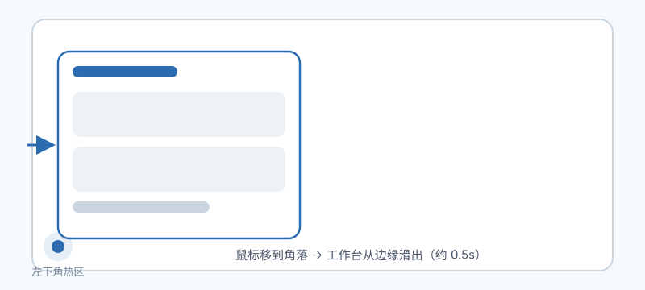
  <figcaption>鼠标移到角落 → 工作台从边缘滑出</figcaption>
</figure>

## 2. 卡片面板
Card Panels

默认 3×3 卡片网格，每格是一个独立文件夹面板。卡片可拖动标题栏互相换位，长按拖入文件夹即可定制属于你的版面。

A 3×3 grid of card panels, each an independent folder view. Drag a panel's title bar to swap positions; drop a folder in to make it yours.

<figure>
  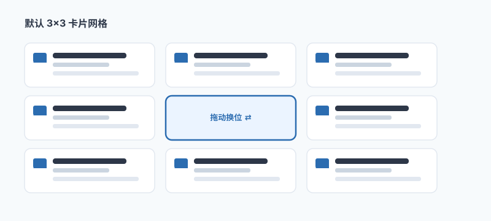
  <figcaption>3×3 卡片网格，拖动标题栏即可换位</figcaption>
</figure>

## 3. 文件与文件夹操作
File &amp; Folder Operations

双击打开、右键唤出系统原生菜单、把文件拖入卡片即复制、跨面板拖拽即移动——所有 Shell 操作一键可达。

Double-click to open, right-click for the native Explorer menu, drag a file in to copy, drag across panels to move — every shell action, one gesture away.

<figure>
  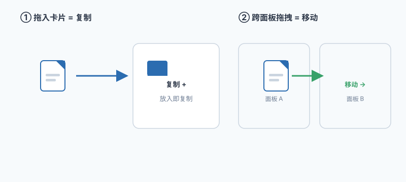
  <figcaption>拖入 = 复制，跨面板拖拽 = 移动</figcaption>
</figure>

## 4. 进入分屏模式
Split View

在文件夹<b>名称</b>上双击（而非图标）即进入左右分屏：左侧导航、右侧预览，顶部显示相对路径；点左侧区域即可退出。

Double-click a folder name (not the icon) to enter a side-by-side split: navigate on the left, preview on the right, with a relative-path breadcrumb on top. Click the left pane to exit.

<figure>
  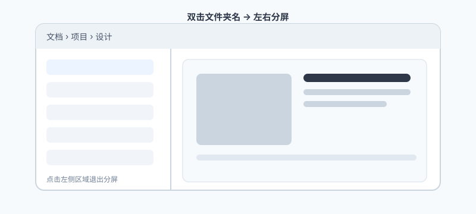
  <figcaption>双击文件夹名 → 左右分屏，点左侧退出</figcaption>
</figure>

## 5. 时光文件
TimeCollect

新文件自动按"今天 / 昨天 / 前天 / 近七天 / 早些时候"归集到对应时间桶，实时刷新。再也不用手动建"2026-08"之类的日期文件夹。

New files are auto-bucketed into Today / Yesterday / 2 days ago / Last 7 days / Earlier and refreshed live. No more hand-made date folders.

<figure>
  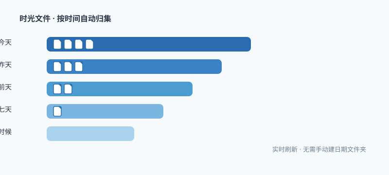
  <figcaption>文件按时间自动归集，无需手动建文件夹</figcaption>
</figure>

## 6. 设置卡片
Settings Card

拖动文件夹到设置卡即可绑定面板内容；菜单中切换单文件夹 / 多文件夹（单选 / 多选）聚合，灵活掌控每个面板显示什么。

Drag a folder onto the settings card to bind panel content; toggle single-folder or multi-folder (single/multi-select) aggregation from the menu to control exactly what each panel shows.

<figure>
  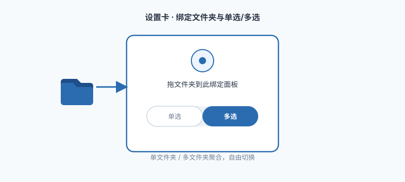
  <figcaption>拖文件夹进设置卡，单选 / 多选自由切换</figcaption>
</figure>

## 7. 双主题与视图模式
Themes &amp; View Modes

主菜单一键切换深 / 浅主题并记忆偏好；配合大卡片 / 小卡片视图模式，亮屏护眼随心切换。

One tap in the main menu switches between dark and light themes and remembers your choice; pair it with large/small card view modes for the look you want.

<figure>
  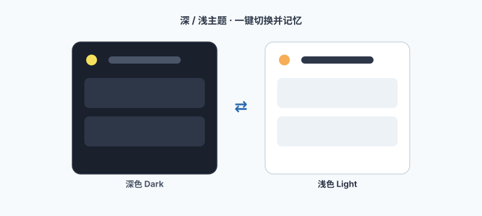
  <figcaption>深 / 浅主题一键切换并记忆</figcaption>
</figure>

## 8. 便捷操作指南（推荐）
Quick Tips — recommended

以下是我们最推荐的上手捷径，帮你把 NoviDesk 用得最顺手：

Our top recommended shortcuts to get the most out of NoviDesk:

<ul class="tips">
  <li>
    
    <b>呼出 / 收起 · Show / Hide</b>
    
鼠标移到屏幕左下角，工作台自动滑出；移开自动隐藏——全程零点击，不占任务栏。

    
Hover the bottom-left corner to summon the workspace; move away and it hides — zero-click, no taskbar clutter.

  </li>
  <li>
    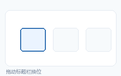
    <b>卡片换位 · Rearrange Cards</b>
    
拖动面板标题栏即可与其它面板交换位置，10 秒搭出你的专属版面。

    
Drag a panel's title bar to swap it with another — build your own layout in seconds.

  </li>
  <li>
    
    <b>秒进分屏 · Instant Split View</b>
    
在文件夹名称上双击即进入左右分屏，左侧导航、右侧预览，再点左侧退出。

    
Double-click a folder name to enter a side-by-side split (navigate left, preview right); click the left pane to exit.

  </li>
  <li>
    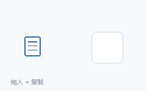
    <b>拖拽即复制 / 移动 · Drag to Copy / Move</b>
    
把文件拖进卡片即复制，跨面板拖拽即移动，免右键、免菜单。

    
Drag a file into a card to copy, or across panels to move — no right-click needed.

  </li>
  <li>
    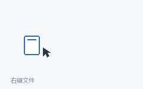
    <b>原生菜单 · Native Context Menu</b>
    
在文件上右键即唤出系统 Explorer 菜单，所有 Shell 操作一键可达。

    
Right-click any file for the native Explorer menu — every shell action, one gesture away.

  </li>
  <li>
    
    <b>时光收纳 · TimeCollect</b>
    
新文件自动按"今天 / 昨天 / 前天 / 近七天 / 早些时候"归集，无需手动建日期文件夹。

    
New files auto-bucket into Today / Yesterday / 2 days ago / Last 7 days / Earlier — no manual date folders.

  </li>
  <li>
    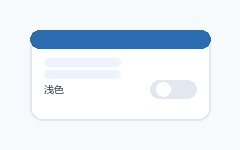
    <b>一键换肤 · One-tap Theming</b>
    
主菜单一键切换深 / 浅主题并记忆偏好，亮屏护眼随心。

    
One tap in the main menu switches dark / light themes and remembers your choice.

  </li>
  <li>
    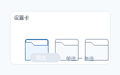
    <b>单选 / 多选 · Single / Multi Select</b>
    
设置面板切换单文件夹或多文件夹聚合，灵活掌控每个面板显示什么。

    
Toggle single-folder or multi-folder aggregation in settings to control exactly what each panel shows.

  </li>
</ul>
